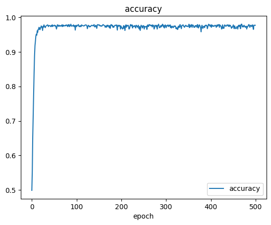
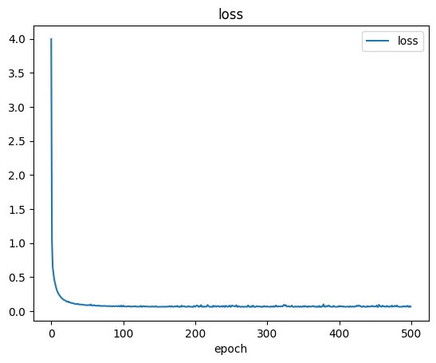
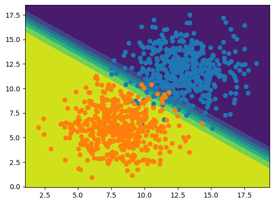
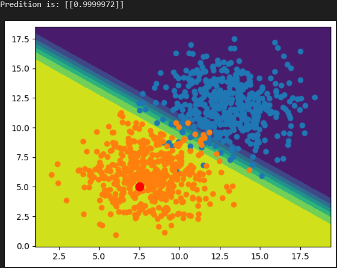

# Simple Perceptron Model using Keras

## Objective 
- Project to implement the Tensorflow and Keras libraries to train and test a single layer neural network to classify a dataset into 2 discrete classes

## Method
- Similar method applied to that used in the [Simple Perceptron Model](https://github.com/sebdisiena/Simple-Perceptron-Model?tab=readme-ov-file) repository
- Utilised Keras' Adam stochastic gradient descent model  

## Results
- Accuracy of 0.9754 after 500 epochs 
  <!--  -->
   
- Loss of 0.0797 after 500 epochs
  <!--  -->
  
- Effectively plotted regions for classification through contour plot
  <!--  -->
  
- Model was successful in classifying a random inputted data point into the correct class with 0.9999972 prediction
  <!--  -->
  